
You can also find my articles on my <a href="{{site.author.googlescholar}}">Google Scholar profile</a>. 
In top venues: TPAMI × 3, CVPR × 5, ICCV × 1, ECCV × 1, MM × 1

<h2>2024</h2>
  

    

      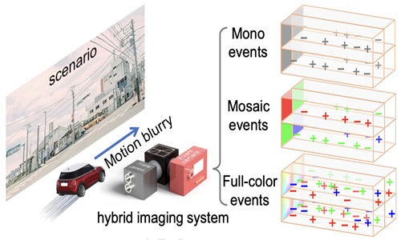
    

    

      <papertitle>Color4E: Event demosaicing for full-color event guided image deblurring</papertitle>
       
      Yi Ma#,<strong>Peiqi Duan#</strong>, Yuchen Hong, Chu Zhou, Yu Zhang, Jimmy Ren, and Boxin Shi*
       
      <em>ACM MM</em>, 2024
       
    

  

  

    

      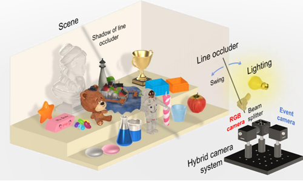
    

    

      <papertitle>EvDiG: Event-guided direct and global components separation</papertitle>
       
      Xinyu Zhou, <strong>Peiqi Duan</strong>, Boyu Li, Chu Zhou, Chao Xu, and Boxin Shi*
       
      <em>CVPR</em>, 2024  [Received full marks]  [Oral presentation, 0.78%]
       
      <a href="https://assets.ctfassets.net/yreyglvi5sud/4rrKmGuR98bvBBmLlZK7i3/7c2a00d49adde30a4caba7cdec852f24/Zhou_CVPR24.pdf">[paper]</a> 
      <a href="https://www.youtube.com/watch?v=y0bMZnUJt14">[video]</a>
    

  

  

    

      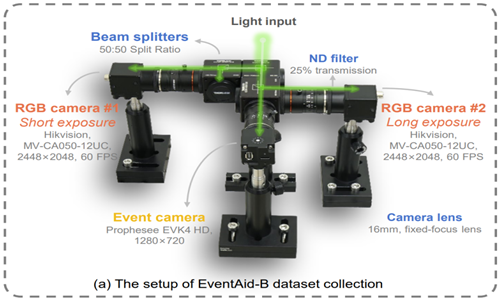
    

    

      <papertitle>EventAid: Benchmarking event-aided image/video enhancement algorithms with real-captured hybrid dataset</papertitle>
       
      <strong>Peiqi Duan#</strong>, Boyu Li#, Yixin Yang, Hanyue Lou, Minggui Teng, Yi Ma, Boxin Shi*
       
      <em>Arxiv</em>, 2024
       
      <a href="https://arxiv.org/pdf/2312.08220">[paper]</a> 
    

  

<h2>2023</h2>
  

    

      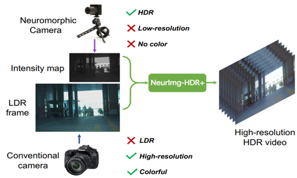
    

    

      <papertitle>Hybrid high dynamic range imaging fusing neuromorphic and conventional images</papertitle>
       
      Jin Han, Yixin Yang, <strong>Peiqi Duan</strong>, Chu Zhou, Lei Ma, Chao Xu, Tiejun Huang, Imari Sato, and Boxin Shi*
       
      <em>TPAMI</em>, 2023
       
      <a href="https://downloads.ctfassets.net/yreyglvi5sud/7yA8sqjDJilRmL5iseiRpB/734af0b70b6b8966d79ff4dd6d8cf73a/Han_TPAMI22.pdf">[paper]</a> 
      <a href="https://github.com/hjynwa/NeurImg-HDR">[website]</a>
    

  

  

    

      
    

    

      <papertitle>NeuroZoom: Denoising and super resolving neuromorphic events and spikes</papertitle>
       
      <strong>Peiqi Duan</strong>, Yi Ma, Xinyu Zhou, Xinyu Shi, Zihao W. Wang, Tiejun Huang, and Boxin Shi*
       
      <em>TPAMI</em>, 2023
       
      <a href="https://downloads.ctfassets.net/yreyglvi5sud/CfT1NA9r1HNehoQqZyf5t/0f0e305cfd5b73471226f5ef1dfa52fe/Duan_TPAMI23_comp.pdf">[paper]</a> 
      <a href="https://github.com/hjynwa/NeurImg-HDR">[website]</a>
    

  

  

    

      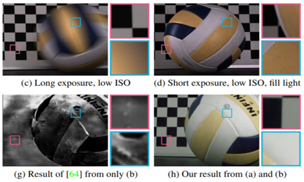
    

    

      <papertitle>Coherent event guided low-light video enhancement</papertitle>
       
      Jinxiu Liang, Yixin Yang, Boyu Li, <strong>Peiqi Duan</strong>, Yong Xu, and Boxin Shi*
       
      <em>ICCV</em>, 2023
       
      <a href="https://assets.ctfassets.net/yreyglvi5sud/4jmy8h8OR0kmr3Oj1YaOIf/94751ea976fee4b06d9127095ac0249c/Liang_ICCV23a.pdf">[paper]</a> 
      <a href="https://sherrycattt.github.io/EvLowLight/">[website]</a>
    

  

  

    

      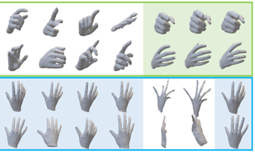
    

    

      <papertitle>EvPlug: Learn a plug-and-play module for event and image fusion</papertitle>
       
      Jianping Jiang, Xinyu Zhou, <strong>Peiqi Duan</strong>, Boxin Shi*
       
      <em>Arxiv</em>, 2023
       
      <a href="https://arxiv.org/pdf/2312.16933">[paper]</a> 
    

  

<h2>2022</h2>
  

    

      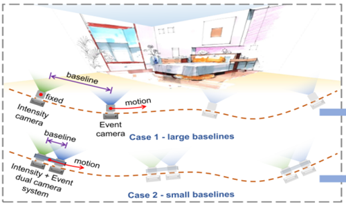
    

    

      <papertitle>Data association between event streams and intensity frames under diverse baselines</papertitle>
       
      Dehao Zhang, Qiankun Ding, <strong>Peiqi Duan</strong>, Chu Zhou, and Boxin Shi*
       
      <em>ECCV</em>, 2022
       
      <a href="https://assets.ctfassets.net/yreyglvi5sud/77lslHrshWxDUxmUla9out/b1772a73762d82a0a039fa96d506bbc3/Zhang_ECCV22e.pdf">[paper]</a> 
    

  

   

    

      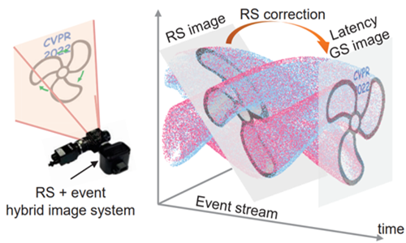
    

    

      <papertitle>EvUnroll: Neuromorphic events based rolling shutter image correction</papertitle>
       
     Xinyu Zhou#,<strong>Peiqi Duan#</strong>, Yi Ma, and Boxin Shi*
       
      <em>CVPR</em>, 2022
       
      <a href="https://assets.ctfassets.net/yreyglvi5sud/1VoRnvDiIhvSnL0yc7TpAh/4e69c5da94f6d61e3f7172a10edf92b2/Zhou_CVPR22a.pdf">[paper]</a> 
      <a href="https://github.com/zxyemo/EvUnroll">[website]</a>
    

  

  <h2>2021</h2>
  

    

      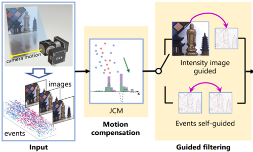
    

    

      <papertitle>Guided Event Filtering: Synergy between intensity images and neuromorphic events for high performance imaging</papertitle>
       
      <strong>Peiqi Duan#</strong>, Zihao W. Wang#, Boxin Shi*, Oliver Cossairt, Tiejun Huang, and Aggelos K. Katsaggelos
       
      <em>TPAMI</em>, 2021
       
      <a href="https://downloads.ctfassets.net/yreyglvi5sud/7Lv91dkRm8ccSeSj7E8pkb/0e61ecea37676e626ea32e5a2683ad41/Duan_TPAMI21.pdf">[paper]</a> 
      <a href="https://sites.google.com/view/guided-event-filtering/">[website]</a>
    

  

   

    

      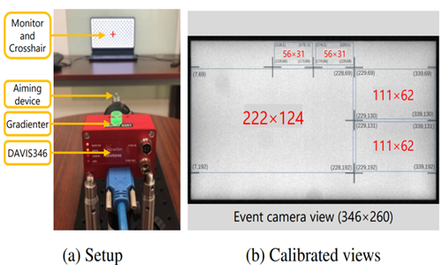
    

    

      <papertitle>EventZoom: Learning to denoise and super resolve neuromorphic events</papertitle>
       
     <strong>Peiqi Duan</strong>, Zihao W. Wang, Xinyu Zhou, Yi Ma, and Boxin Shi*
       
      <em>CVPR</em>, 2021  [Oral presentation, 4.19%]
       
      <a href="https://assets.ctfassets.net/yreyglvi5sud/MyFOVymXNOWuqYwi5tWMK/5be8c2c2c7f0061de3e5d39979ea3283/Duan_CVPR21.pdf">[paper]</a> 
      <a href="https://sites.google.com/view/EventZoom">[website]</a>
    

  

<h2>2020</h2>
  

    

      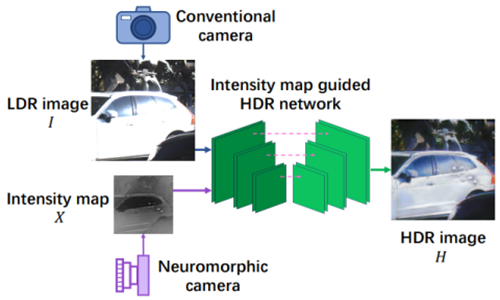
    

    

      <papertitle>Neuromorphic camera guided high dynamic range imaging</papertitle>
       
      Jin Han, Chu Zhou, <strong>Peiqi Duan</strong>, Yehui Tang, Chang Xu, Chao Xu, Tiejun Huang, and Boxin Shi*
       
      <em>CVPR</em>, 2020
       
      <a href="https://downloads.ctfassets.net/yreyglvi5sud/6AVrg44HPuHRAp3NlzUmtZ/bb1bb60a12c73a12dd8d117dcfdf2422/Han_CVPR20.pdf">[paper]</a> 
    

  

   

    

      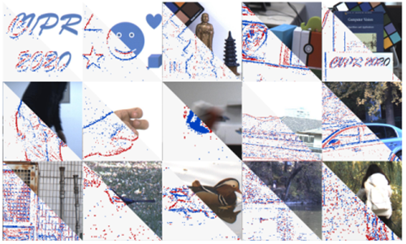
    

    

      <papertitle>Joint filtering of intensity images and neuromorphic events for high-resolution noise robust imaging</papertitle>
       
     Zihao Wang#, <strong>Peiqi Duan#</strong>, Oliver Cossairt, Aggelos Katsaggelos, Tiejun Huang, and Boxin Shi*
       
      <em>CVPR</em>, 2020
       
      <a href="https://downloads.ctfassets.net/yreyglvi5sud/3cjQpBS1ZziYsK5oWHAhW9/775c6d7a2b4a3964c92ea662cd71ef72/Wang_CVPR20.pdf">[paper]</a> 
      <a href="https://sites.google.com/view/guided-event-filtering">[website]</a>
    

  

